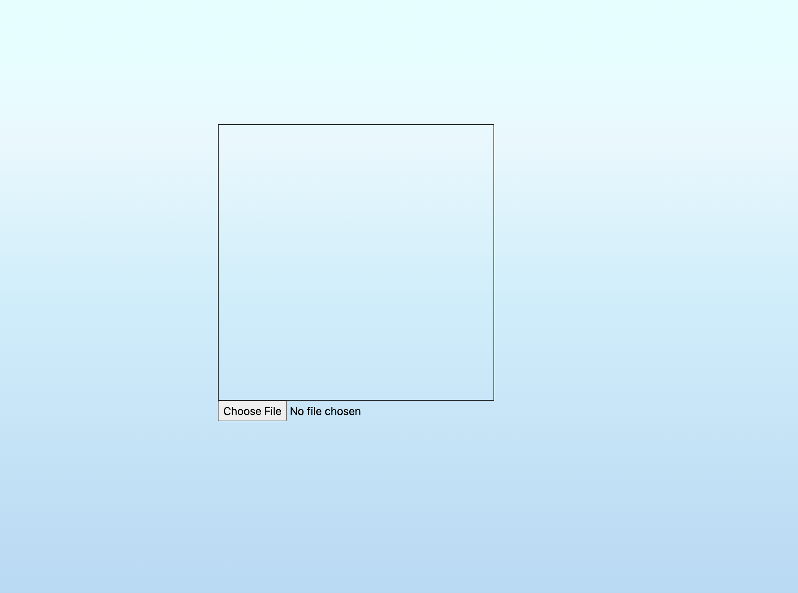

## :crab: Rust->WASM JPG Decoder :art:

  

Hello Hello!

  

Welcome to my Rust->WASM JPG decoder. I am building off my previous iteration, [a jpg decoder in go lang](https://github.com/stephanrotolante/go-lang-jpg-analyzer).

  

### :video_game: How to use :video_game:

#####  Install the deps :earth_americas:
This is used for file watch changes
```
npm install -g nodemon@3.0.2
```

Install the go lang deps  
```
cd web &&  go get -u
```

Install wasm pack for the rust-> wasm compilation
```
https://rustwasm.github.io/wasm-pack/installer/
```
##### Running the project :sunglasses:
The first part of the running the project you need to run the go lang server that serves up the html and wasm files. 

To do this run:
```
cd web && make watch
```

Now while the go lang server is running, we need need to compile the rust
```
wasm-pack build --target web
```


After both of those steps are completed go to `http://localhost:4005/home` in your browser





When you see this choose the jpg file stored on the `/imgs` folder of this repo. It is the only one that works right now. There is still parts of the decoder I need to implement :neckbeard: